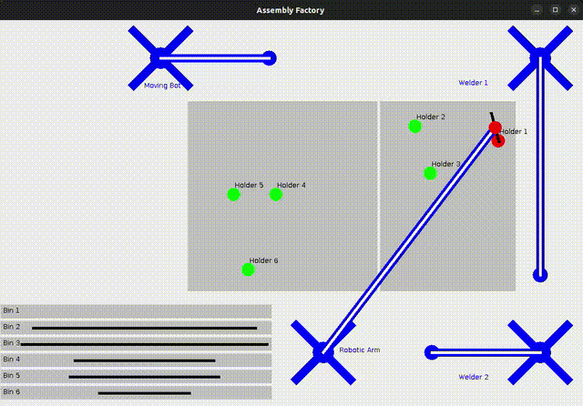

# IRTS Practice

This project can be executed with

```
jason irts_practice.mas2j
```



## Key System Modifications:

*   **Enhanced Bin Production**:
    *   Introduction of `human_producer_bin.asl` agents (e.g., Bob, Alice, Tom, Mary) specializing in specific bin types, featuring work periods, quotas, variable speed, and social distraction mechanics.
    *   Conceptual robot bin producers: flexible, non-distracted, but with a chance of breakdown and repair.
    *   The `binagent.asl` now primarily represents the output/storage of these production processes.
*   **Dual Welding Agents (Team 4 Specific)**:
    *   The system incorporates two `weldingagent.asl` instances.
    *   Both welders can operate in any assembly area.
    *   They are capable of welding simultaneously, improving throughput.
*   **Interaction Patterns**: A locking mechanism was used to mantain unique access to the bins, both for humans, producer robots and the moving robot.
*   **Environment Updates**: The underlying environment (`fac1env.java`) was updated to support the drawing and manipulation of two welding robots.

## Agent Architecture Summary

This document outlines the roles, interactions, and key functionalities of the agents within the simulated bicycle frame assembly system. The system has been enhanced to include detailed bin production processes involving both human and robotic agents, and specific modifications according to team assignments (Team 4: dual, flexible welding agents). The architecture is based on the `.asl` agent programming files located in `src/agt`.

### Agent Roles:

*   **`binagent.asl`**:
    *   **Role**: Primarily represents a container for parts, simulating parts becoming available. It is also conceptually linked to the *output* of bin construction agents (human and robot producers), though it doesn't perform the construction itself.
    *   **Note**: This agent is for holding components/materials. The actual construction of bins is handled by `human_producer_bin.asl` and dedicated robot agents.
    *   **Key Actions/Beliefs**: `refill_bin(N)` (environment action indicating a bin is filled by a producer), `binfull(N)` (belief).

*   **`human_producer_bin.asl`** (e.g., `human_producer_bin1.asl`, etc.):
    *   **Role**: Represents human workers (e.g., Bob, Alice, Tom, Mary) responsible for constructing specific types of bins.
    *   **Functionality**:
        *   Each human agent specializes in building one type of bin.
        *   They operate within pre-established work periods (e.g., 80000 ms) and have a production quota per period.
        *   Production speed can vary: they can work faster to meet quotas or slower if distracted.
        *   Distractions can occur from chatting with other human agents (e.g., when bored, for 400-800 ms), but they must compensate for delays to meet their quota.
        *   They interact with a `bin_locking_agent` to get exclusive access to work on their assigned bin.
    *   **Interaction**: Listens for `needs_parts_public` broadcasts for their assigned bin, communicates with `bin_locking_agent` to acquire/release locks, and eventually triggers a `refill_bin` action in the environment.

*   **Robot Bin Producers (conceptual, likely managed by a generic robot agent script)**:
    *   **Role**: Represents robot workers that construct bins.
    *   **Functionality**:
        *   Can build any type of bin as needed.
        *   Not subject to distractions like human agents.
        *   Maintain a consistent production rate for parts/bins.
        *   Have a probability of breaking down (e.g., 5-10%), requiring a fixed repair time.
    *   **Interaction**: Similar to human producers, they interact with the environment to produce bins and must coordinate access to shared resources (e.g., the specific bin being worked on) through a locking mechanism to prevent conflicts, analogous to how human producers use the `bin_locking_agent`.

*   **`assemblyareaagent.asl`**:
    *   **Role**: Manages exclusive access to "assembly areas" (physical zones 1 and 2) using a locking mechanism.
    *   **Functionality**: Provides goals like `!fullAreaLockFor(Agent)`, `!lockAreaFor(Agent,Area)`, and their unlock counterparts.
    *   **Interaction**: Other agents send `achieve` messages to request/release locks. It calls `lock_area(N)` / `unlock_area(N)` in the environment.

*   **`holdingagent.asl`**:
    *   **Role**: Represents a fixture or jig that holds a specific part (agents `holdingagent1` through `holdingagent6`).
    *   **Functionality**: Reacts to `part_in_place(N)` (from `roboticarmagent`) by calling `hold_part(N)` (env action) and broadcasting `holding(N)`. Reacts to `mover(hold)` (from `movingagent`) by calling `unhold_part(N)` and retracting `holding(N)`.
    *   **Interaction**: Responds to environment percepts/agent broadcasts; broadcasts `holding(N)` status.

*   **`roboticarmagent.asl`**:
    *   **Role**: Picks parts from `binagent`s and places them into `holdingagent`s.
    *   **Functionality**: Main goal `!positionParts`. Requests locks from `assemblyareaagent`. Picks parts (`pick_part` env action), moves, signals `part_in_place(N)` to `holdingagent`, waits for `holding(N)` belief, then releases part (`release_part` env action).
    *   **Interaction**: Checks `binfull(Part)`, communicates with `assemblyareaagent` and `holdingagent` (via broadcasts and belief checks).

*   **`weldingagent.asl`**:
    *   **Role**: Performs welding on parts secured by `holdingagent`s. There are **two** welding agents in the system.
    *   **Functionality**:
        *   Main goal `!weldParts`.
        *   Checks `jointPartsInPlace(JointNum)` (derived from `holding(PartNum)` beliefs).
        *   Requests locks from `assemblyareaagent`. Both welders can operate in any assembly area and can weld simultaneously if different areas are locked or if their tasks within the same area are independent and managed.
        *   Moves, performs `weld` (env action), broadcasts `joint(JointNum)`.
    *   **Interaction**: Checks `holding(PartNum)`, communicates with `assemblyareaagent` for area access, broadcasts `joint(JointNum)`.

*   **`movingagent.asl`**:
    *   **Role**: Moves the completed (welded) frame.
    *   **Functionality**: Main goal `!removeFrame`. Waits for `weldingCompleted` (all `joint(N)` true). Requests locks. Picks frame (`pick_part` env action), broadcasts `mover(hold)`. Waits for `holdersReleased` (all `holding(N)` false). Moves frame to stock (`release_part` env action).
    *   **Interaction**: Checks `weldingCompleted`, communicates with `assemblyareaagent`, broadcasts `mover(hold)`, checks `holdersReleased`.

### Overall Interaction Flow (Simplified):

1.  **Bin Construction & Parts Supply**:
    *   `human_producer_bin` agents and Robot Bin Producers construct bins. Humans specialize and manage quotas/distractions; robots are flexible but can break.
    *   `binagent`s represent these constructed bins now filled with parts.
2.  **Area Locking**: `roboticarmagent` & `weldingagent`s coordinate access to assembly areas via `assemblyareaagent`.
3.  **Part Placement**: `roboticarmagent` picks parts from `binagent`s, places them in `holdingagent`s, which secure them. This involves communication between `roboticarmagent` and `holdingagent`.
4.  **Welding**: The two `weldingagent`s weld parts once `holdingagent`s confirm they are secure. They can operate in any assembly area and potentially simultaneously. Progress is broadcast.
5.  **Frame Removal**: `movingagent` takes the finished frame after `weldingagent`s signal completion and `holdingagent`s release parts upon `mover(hold)` signal.